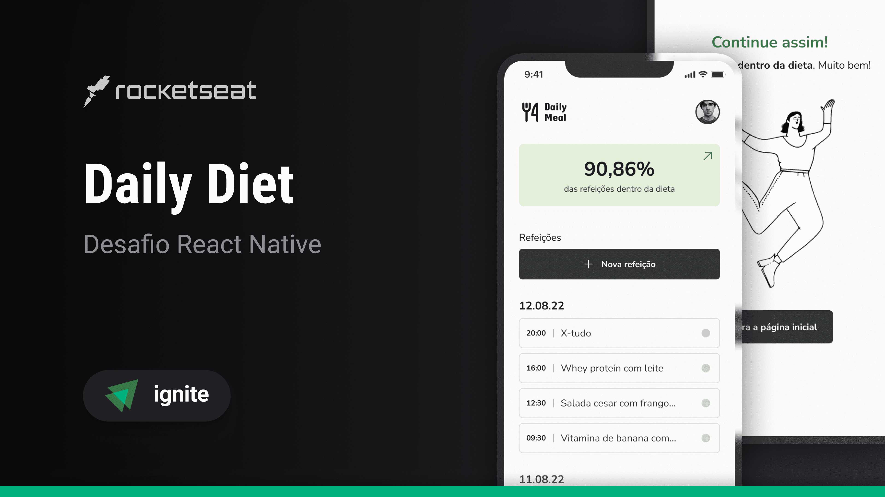
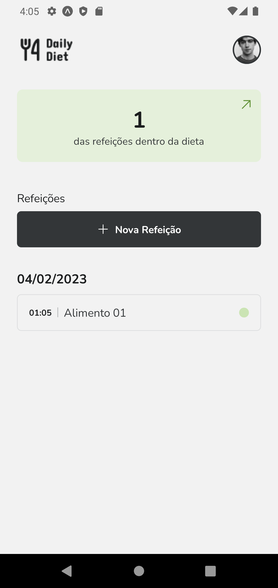
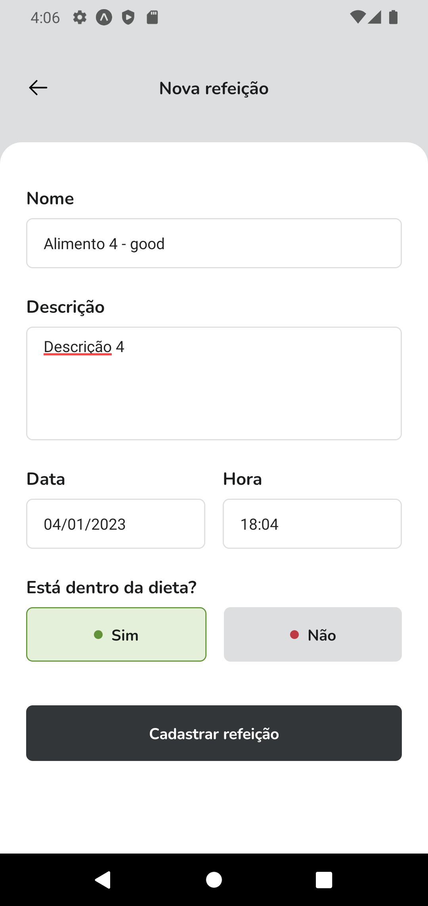
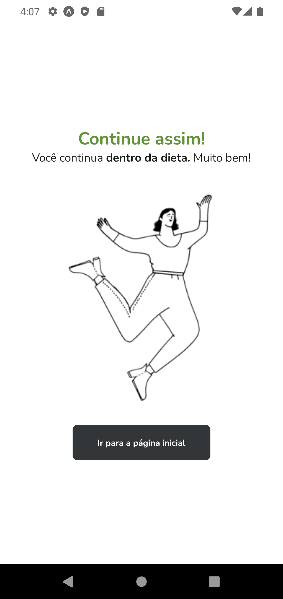
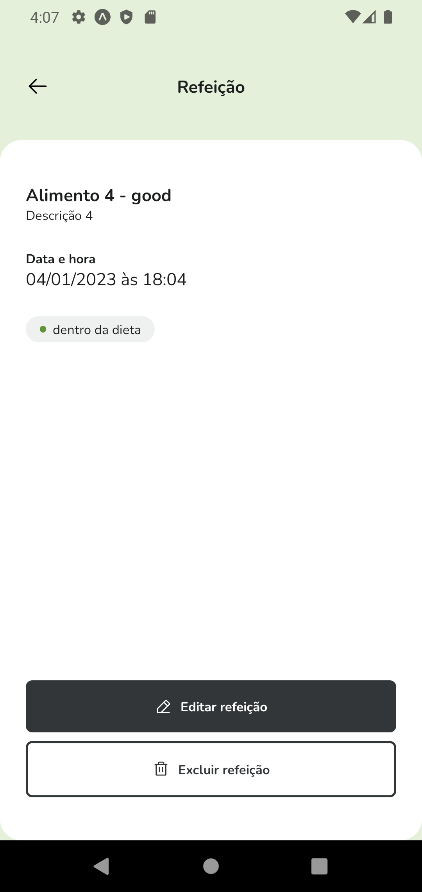
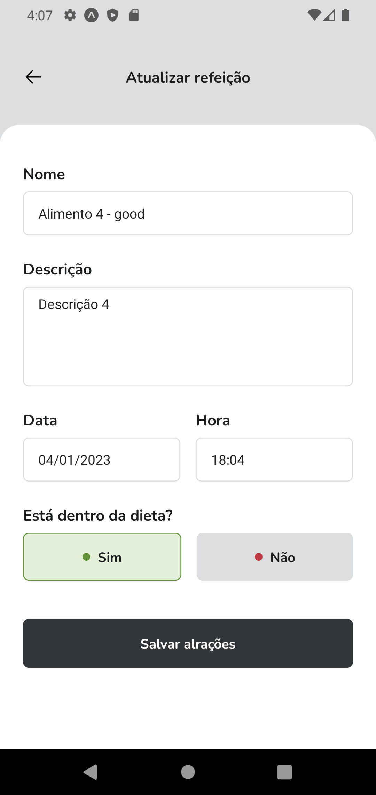
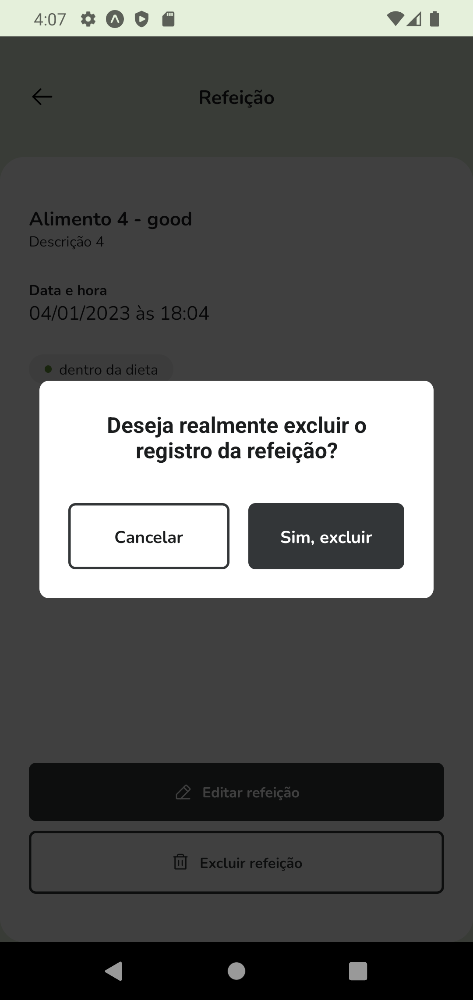

## Sobre o projeto

Daily Diet é uma aplicação móvel para controle alimentar, a aplicação é capaz de receber registros das refeições do dia e gerar estatísticas do desempenho alimentar.

<table>
  <tr>
    <td></td>
    <td></td>
    <td></td>
  </tr>
  <tr>
    <td></td>
    <td></td>
    <td></td>
  </tr>
</table>

## 🛠 Tecnologias

As seguintes ferramentas foram usadas na construção do projeto:

- [Expo](https://expo.io/)
- [React Native](https://reactnative.dev/)
- [TypeScript](https://www.typescriptlang.org/)
- [Styled Components](https://styled-components.com/)

## Features

- [x] Cadastro de tasks
- [x] Exclusão de taks
- [x] Marcar task como concluida

## Pré-requisitos

Antes de começar, você vai precisar ter instalado em sua máquina as seguintes ferramentas:
[Git](https://git-scm.com), [Node.js e npm](https://nodejs.org/en/).

Além disto é bom ter um editor para trabalhar com o código como [VSCode](https://code.visualstudio.com/), e um emulador ou aparelho com o Expo Go instalado.

### Executando o aplicativo

```bash
# Clone este repositório
$ git clone https://github.com/gustavosorati/daily-diet

# Vá para a pasta server
$ npm install

# Instale as dependências
$ npx expo start
```


